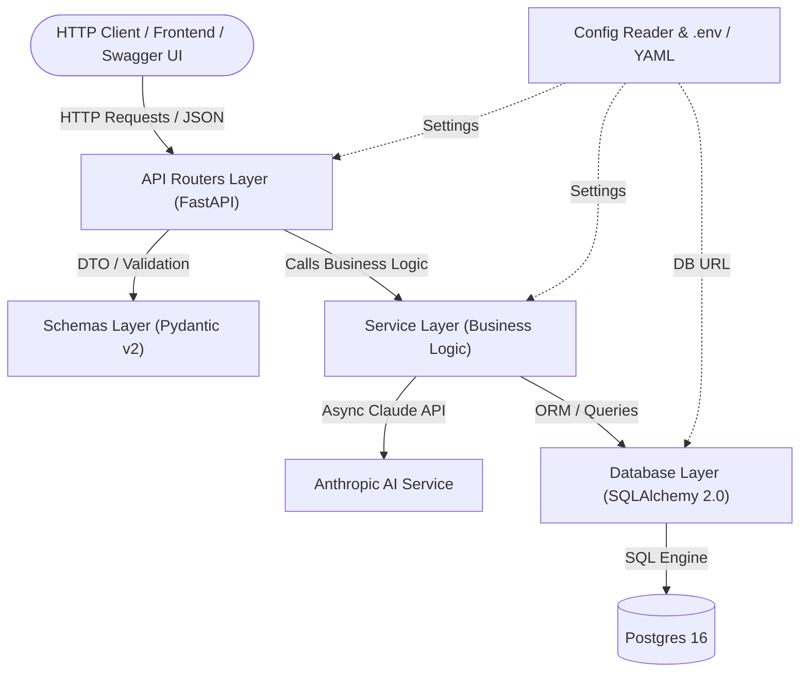
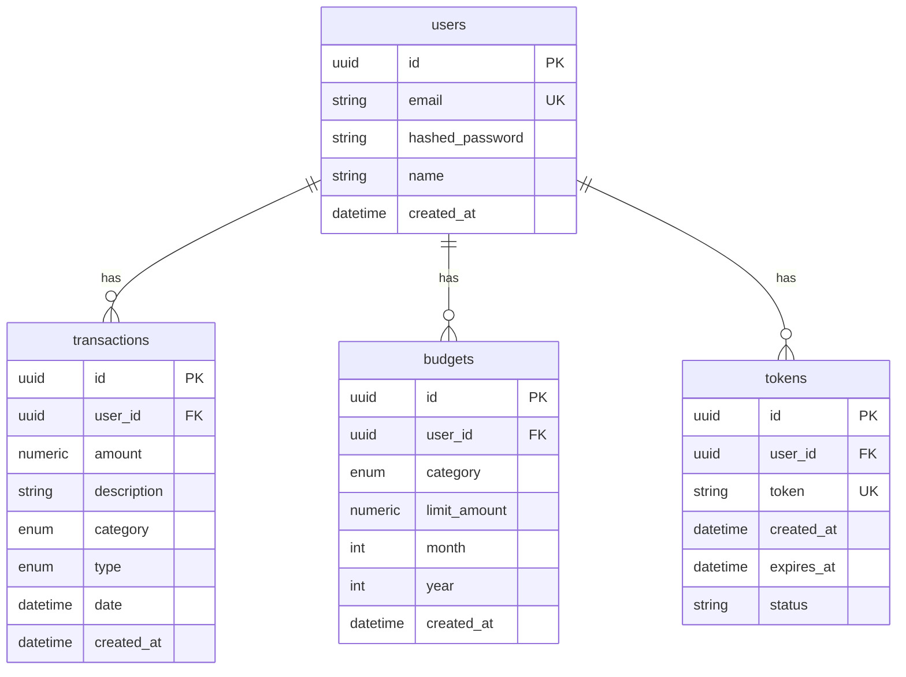

# Архитектура и база знаний проекта Finance App API

> [!NOTE]
> Данный документ является единым источником правды по архитектуре, модели данных, контрактам и правилам работы с проектом **Finance App API**.
> Реестр задач и багов с указанием конкретных файлов и строк кода находится в [`TASKS.md`](file:///Users/user/finance_app/TASKS.md).

---

## 1. Назначение и стек технологий

**Finance App API** — бэкенд-сервис (REST API) для персонального учета финансов с интеграцией искусственного интеллекта (Anthropic Claude) и возможностью пакетной офлайн-синхронизации.

* **Репозиторий**: `jbronxxx/finance_app_api`
* **Фреймворк**: FastAPI (Python 3.11+)
* **База данных и ORM**: PostgreSQL 16, SQLAlchemy 2.0 (Async Session, asyncpg)
* **Миграции**: Alembic
* **Валидация и DTO**: Pydantic v2 (`ConfigDict`, `Field`)
* **Аутентификация**: JWT (`python-jose`), хеширование паролей (`bcrypt`), ротация Refresh-токенов
* **Интеграция с LLM**: Anthropic Claude API (SDK `anthropic.AsyncAnthropic`)
* **Конфигурация**: PyYAML + `.env` (`python-dotenv`)
* **Контейнеризация**: Docker & Docker Compose
* **Тестирование**: Pytest (`TestClient`, `httpx.AsyncClient`)

---

## 2. Архитектурный стиль и слои (Layered Architecture)

Проект спроектирован по принципам многослойной архитектуры с четким разделением ответственности (Separation of Concerns):



### Зоны ответственности слоев:
1. **API Routers (`app/routers/`)**: Прием и диспетчеризация HTTP-запросов, проверка прав доступа, сериализация ответов в единые форматы `ApiResponse[T]` и `ErrorResponse`. Сложной бизнес-логики не содержат.
2. **Service Layer (`app/services/`)**: Вся предметная логика, расчеты бюджетов, криптография, ротация токенов, интеграция с внешними LLM API и кэширование аналитики.
3. **Schemas (`app/schemas/`)**: Pydantic-схемы валидации входящих данных (Request DTO) и структуры ответов (Response DTO).
4. **Data Layer (`app/models/`, `app/database.py`)**: Определение схемы реляционных таблиц через декларативные модели SQLAlchemy 2.0 и управление жизненным циклом сессий `async_session_maker`.

---

## 3. Схема базы данных



### Таблицы:
* `users`: Пользователи системы (email, хешированный пароль, имя)
* `tokens`: JWT access и refresh токены сессий пользователей с отслеживанием статуса (`active`, `revoked`, `expired`)
* `transactions`: Финансовые операции (доход/расход с категорией и датой)
* `budgets`: Лимиты расходов по категориям (по месяцам и годам)
* `alembic_version`: Служебная таблица для отслеживания миграций

### Перечисления и категории (Category & TransactionType):
Категории разделены на два множества для обеспечения валидности финансовых данных:
* **Категории доходов (`INCOME_CATEGORIES`)**: `salary` (зарплата), `freelance` (фриланс/подработка), `investments` (инвестиции/вклады), `transfers` (переводы и подарки), `cashback` (кэшбэк и бонусы), `sales` (продажи), `other` (прочее).
* **Категории расходов (`EXPENSE_CATEGORIES`)**: `food` (продукты и питание), `transport` (транспорт), `entertainment` (развлечения), `health` (здоровье и медицина), `subscriptions` (подписки и сервисы), `shopping` (покупки и одежда), `other` (прочее).

**Правила валидации:**
1. При создании или синхронизации транзакций категория строго сопоставляется с типом операции: доходы не могут быть отнесены к сугубо расходным статьям, а расходы — к доходным источникам.
2. Бюджеты (`budgets`) могут устанавливаться исключительно для расходных категорий (`EXPENSE_CATEGORIES`).

---

## 4. Структура каталогов

```
finance_app/
├── app/                        # Основной пакет приложения
│   ├── models/                 # ORM-модели SQLAlchemy 2.0
│   │   └── models.py           # Модели User, Token, Transaction, Budget и Enum-типы
│   ├── routers/                # Эндпоинты FastAPI (Контроллеры)
│   │   ├── auth.py             # Авторизация (/register, /login, /refresh, /logout, /me)
│   │   ├── budgets.py          # CRUD бюджетов и расчет ETag
│   │   ├── insights.py         # AI-аналитика расходов (/api/v1/insights)
│   │   ├── sync.py             # Пакетная офлайн-синхронизация
│   │   └── transactions.py     # CRUD транзакций и расчет ETag
│   ├── schemas/                # Pydantic v2 DTO
│   │   └── schemas.py          # ApiResponse[T], ErrorResponse, схемы сущностей
│   ├── services/               # Слой бизнес-логики
│   │   ├── ai_service.py       # Интеграция с Anthropic Claude и кэширование инсайтов
│   │   ├── auth_service.py     # Пароли, JWT, ротация и очистка токенов
│   │   ├── budget_service.py   # Лимиты бюджетов и подсчет расходов
│   │   └── transaction_service.py # Операции с транзакциями и генерация ETag
│   ├── tasks/                  # Фоновые и регламентные процессы
│   │   └── token_cleanup.py    # Регламентная очистка устаревших токенов
│   ├── database.py             # Подключение к PostgreSQL, SessionLocal, UnitOfWork и get_db
│   ├── exceptions.py           # Доменные исключения (AppException) и коды ошибок ErrorCode
│   └── limiter.py              # Инициализация Rate Limiter (SlowAPI)
├── config_reader/              # Загрузка и объединение YAML + .env
│   └── config_reader.py
├── logger/                     # Структурированное логирование
│   └── logger.py
├── migrations/                 # Alembic миграции
│   ├── versions/
│   ├── env.py
│   └── script.py.mako
├── scripts/                    # CLI-скрипты и утилиты
│   └── cleanup_tokens.py       # Запуск регламентной очистки токенов через cron/CLI
├── tests/                      # Набор тестов Pytest
│   ├── conftest.py             # Фикстуры тестов
│   ├── test_ai_service.py      # Модульные тесты AIService
│   ├── test_auth_service.py    # Модульные и интеграционные тесты аутентификации
│   ├── test_budget_service.py  # Модульные тесты сервиса бюджетов
│   ├── test_budgets.py         # Интеграционные тесты эндпоинтов бюджетов
│   ├── test_errors.py          # Тесты контрактов ошибок
│   ├── test_fintech_integrity.py # Тесты точности Decimal и индексов БД
│   ├── test_observability.py   # Тесты healthcheck и сквозного Correlation ID
│   ├── test_security.py        # Тесты CORS, Rate Limiting и сложности паролей
│   ├── test_sync.py            # Интеграционные тесты офлайн-синхронизации
│   ├── test_transaction_service.py # Тесты сервиса транзакций
│   ├── test_transactions.py    # Тесты транзакций и кэширования инсайтов
│   └── test_unit_of_work_and_cleanup.py # Тесты Unit of Work и регламентной очистки токенов
├── .env.example
├── .gitignore
├── alembic.ini
├── app_config.yaml
├── Dockerfile
├── docker-compose.yml
├── main.py                     # Точка входа, lifespan, обработчики ошибок
├── README.md
├── requirements.txt            # Зависимости приложения
├── requirements-dev.txt        # Зависимости для тестирования и разработки
├── RESPONSE_FORMAT.md          # Спецификация форматов ответов API
├── ARCHITECTURE.md             # Архитектурная документация сервиса
├── TEST_CHECKLIST.md           # Чек-лист проверок (автотесты и QA)
└── TASKS.md                    # Полный реестр багов и задач
```

---

## 5. Стандарты контрактов API и соглашения

1. **Единый формат ответов**:
   * **Успешный ответ**: `ApiResponse[T]`
     ```json
     {
       "status": "success",
       "data": {},
       "message": null
     }
     ```
   * **Ответ с ошибкой**: `ErrorResponse` (со строгим машиночитаемым `ErrorCode` в формате `SCREAMING_SNAKE_CASE`):
     ```json
     {
       "status": "error",
       "code": "BUDGET_LIMIT_EXCEEDED",
       "message": "Превышен лимит бюджета для данной категории",
       "details": {}
     }
     ```
   * **Простой ответ**: `BaseResponse` (для операций `delete` / `logout`).
   * Полная спецификация и примеры приведены в [`RESPONSE_FORMAT.md`](file:///Users/user/finance_app/RESPONSE_FORMAT.md).

2. **Исключения**:
   * В контроллерах и сервисах выбрасываются доменные исключения `AppException` (`BadRequestException`, `NotFoundException`, `UnauthorizedException`) из `app.exceptions`, которые автоматически конвертируются в `ErrorResponse` глобальным обработчиком в `main.py`.

3. **Аутентификация и сессии**:
   * Используется схема с двумя токенами: короткоживущий `access_token` (JWT) + долгоживущий `refresh_token` (JWT).
   * **Stateless JWT**: `access_token` не сохраняется в базу данных и валидируется криптографически без обращения к СУБД. При логауте токен добавляется в in-memory Denylist.
   * Реализован паттерн **Refresh Token Rotation**: при обновлении токена старый refresh-токен помечается в БД как `revoked`, а клиенту выдается новая пара токенов.

4. **Безопасность и ограничение частоты запросов (Security & Rate Limiting)**:
   * **CORS Middleware**: Подключен `CORSMiddleware` с параметризацией разрешенных ориджинов, методов и заголовков через `app_config.yaml` и переменные окружения (`CORS_ORIGINS`, `CORS_ALLOW_METHODS`, `CORS_ALLOW_HEADERS`).
   * **Rate Limiting**: Используется `slowapi` для защиты критичных эндпоинтов авторизации (`/register`, `/login` — 5 запросов/мин) и ресурсоемких AI-инсайтов (`/insights` — 10 запросов/мин). При превышении возвращается стандартизированный `ErrorResponse` с HTTP 429 и кодом `RATE_LIMIT_EXCEEDED`.
   * **Валидация сложности паролей**: Пароли при регистрации ограничены 72 байтами (жесткий лимит алгоритма bcrypt) и валидируются на наличие хотя бы одной буквы и одной цифры.
   * **Защита продакшн-конфигурации**: При старте приложения в режиме `debug=False` блокируется запуск с дефолтным секретным ключом `SECRET_KEY`.

5. **Управление транзакциями (Unit of Work & get_db Lifecycle)**:
   * **Чистый слой сервисов**: Сервисы (`TransactionService`, `BudgetService`, `AuthService`) не управляют состоянием транзакции напрямую (`commit`/`rollback`), а только оперируют объектами (`db.add()`, `db.delete()`, `db.flush()`).
   * **Автоматическое управление транзакциями**: Зависимость `get_db` в FastAPI автоматически выполняет `commit()` при успешной обработке запроса и `rollback()` при возникновении исключения.
   * **Контекстный менеджер UnitOfWork**: Предоставляет контекстный менеджер `with UnitOfWork() as session:` для атомарных составных операций вне HTTP-запросов (в фоновых задачах, CLI-скриптах и тестах).

6. **Фоновые и регламентные процессы (Token Cleanup)**:
   * **Периодическая очистка токенов**: Асинхронная корутина `periodic_token_cleanup` запускается в жизненном цикле приложения (`lifespan`) и ежедневно удаляет истекшие или отозванные токены старше 30 дней (`expires_at < now() - interval '30 days'`).
   * **Автономный CLI-скрипт**: Для запуска регламентной очистки через системный планировщик (cron, Kubernetes CronJob) реализован скрипт `scripts/cleanup_tokens.py` с поддержкой параметра `--days`.


---


## 6. Специфика AI Service (`app/services/ai_service.py`)

Сервис `AIService` формирует персонализированные финансовые рекомендации на основе последних транзакций пользователя:
* **Асинхронность и неблокирующие вызовы**: Использует официальный асинхронный клиент `anthropic.AsyncAnthropic` с неблокирующим вызовом `await self.client.messages.create(...)`. Поддерживает внедрение зависимостей (`Dependency Injection`) при инициализации в тестах.
* **Надежное извлечение JSON**: Реализован статический метод `_extract_json()`, очищающий markdown-обертки блоков кода (` ```json ... ``` ` или ` ``` ... ``` `) и выделяющий валидный JSON-объект от первой `{` до последней `}`. Ошибки декодирования безопасно перехватываются без падения сервера.
* **Кэширование аналитики (SHA-256)**: Для предотвращения лишних платных обращений к LLM сервис вычисляет SHA-256 хэш от сводки последних транзакций пользователя. Если состав и свойства транзакций не изменились, результат возвращается мгновенно из in-memory кэша `_cache`. Поддерживается принудительная инвалидация через `invalidate_cache(user_id)` и `clear_cache()`.
* **Временные метки в UTC**: Все генерируемые ответы содержат timezone-aware временные метки `datetime.now(timezone.utc)`.
* **Заглушки при отсутствии ключа**: При пустом или тестовом ключе `ANTHROPIC_API_KEY` (например, `sk-ant-your-key...`) возвращается информационная заглушка `InsightResponse(insights=["В разработке..."])`.

---

## 7. Обсервабилити и Мониторинг (Observability)

Проект включает в себя полноценный стек для мониторинга и логирования, разворачиваемый вместе с основными сервисами:

* **Логирование (Loki + Promtail)**:
  * Сервис `promtail` автоматически монтирует `/var/run/docker.sock` и собирает логи со всех запущенных Docker-контейнеров.
  * Логи пересылаются в `loki` (хранилище логов, оптимизированное для работы с тегами).
* **Сбор метрик (Prometheus + cAdvisor)**:
  * `cadvisor` (Container Advisor) экспонирует системные метрики (потребление CPU, RAM, Network, Disk) по каждому контейнеру.
  * Приложение FastAPI инструментировано библиотекой `prometheus-fastapi-instrumentator`, которая отдает метрики приложения (RPS, latency, status codes) по эндпоинту `/metrics`.
  * `prometheus` собирает метрики и с приложения, и с cAdvisor каждые 15 секунд.
* **Визуализация (Grafana)**:
  * В Grafana настроен автоматический провижининг (provisioning) источников данных (Loki и Prometheus).
  * Предустановлены готовые дашборды для метрик API (FastAPI), утилизации ресурсов контейнеров (cAdvisor) и просмотра логов приложения (Loki).
  * Версия Grafana 9.x используется для обеспечения стабильной поддержки Angular-плагинов, используемых в классических комьюнити-дашбордах мониторинга.


